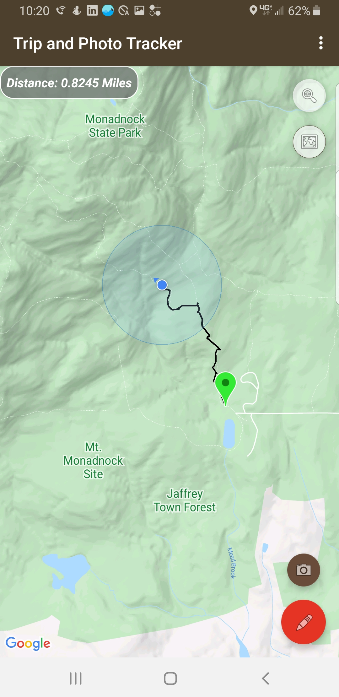
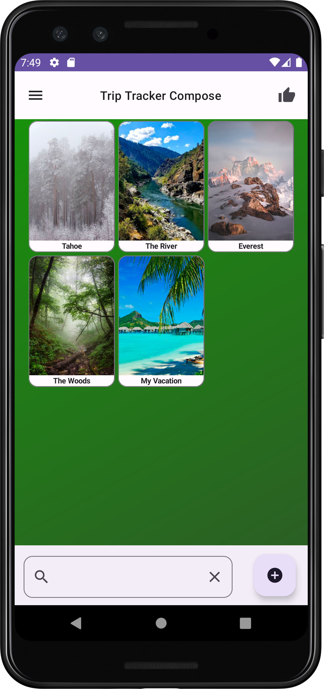

# TripTracker
Plot your hikes on a map and pin pictures to your current location.
This app uses Google Maps services to display the surrounding area and a custom dialog library to display a datepicker to select a trip from a specific time.

Libraries used include:  
Google Maps  
Android Materials  
Jetpack Room  
Picasso  
PhotoView (zoom selected photos)  
Custom Material Dialogs  
Metadata Extractor (to fetch and strip EXIF photo data)  
Adobe XMP  

Jetpack Compose for the new version (not yet published)  

.   
